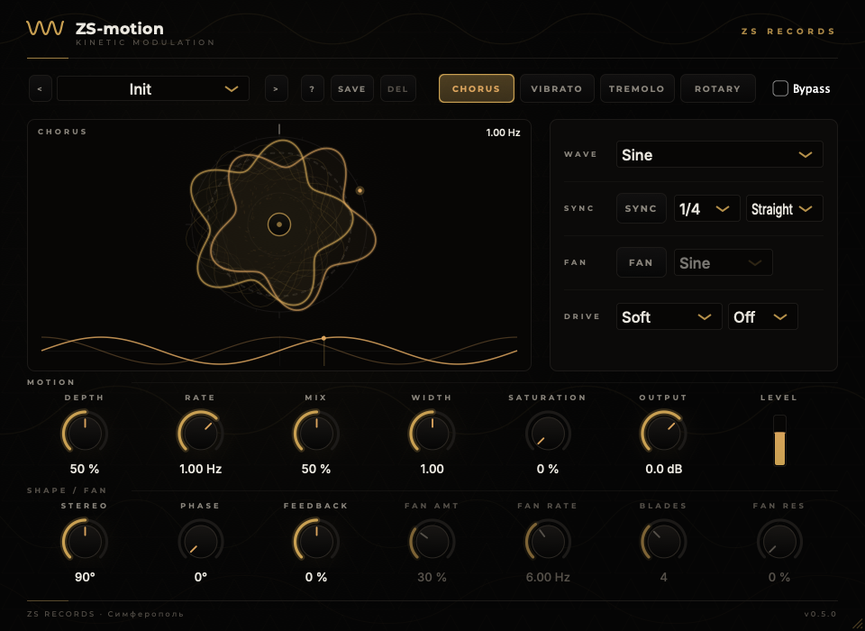

# ZS-motion

Кинетический модуляционный эффект студии **ZS Records** — один LFO, вращающий
несколько классических модуляций, плюс фирменный **Fan** (медленное кольцевое
подобие вентилятора).

Режимы (переключатель `MODE`):

- **CHORUS** — сдвоенная модулируемая линия задержки с обратной связью;
- **VIBRATO** — чистая модуляция высоты (модулируемая задержка без сухого сигнала);
- **TREMOLO** — амплитудная модуляция, uni/bipolar (bipolar → кольцевая);
- **ROTARY** — двухполосная «вращающаяся» кабина: AM + панорама + доплеровская задержка.

Плюс сквозные: **FAN** (лопастная AM с формой несущей и резонансом),
**SATURATION** (soft/asym/hard, с оверсэмплингом 2×/4×), **WIDTH** (M/S),
**DRY/WET** (equal-power), синхронизация с темпом DAW и фабричные пресеты.

Ротор (ROTARY) — с инерцией: скорость плавно разгоняется и тормозит при смене
Rate, как переключение slow/fast у настоящего Leslie (барабан тяжелее рупора).

VST3 · AU · Standalone, macOS, universal (Apple Silicon + Intel).

---

## Пресеты

19 фабричных пресетов, сгруппированных по режимам: хорус (Lush, Whisper, Sixties
Wobble), вибрато (Deep, Tape Warble), тремоло (Slow, Sync Chop, Triplet Pulse,
Helicopter), ротор (Leslie Slow/Fast, Rotary Drive), фирменный вентилятор (Fan
Whir, Ring Fan, Big Blades) и характерные (Warm Motion, Broken Machine, Mono
Collapse).

Свои пресеты сохраняются кнопкой **SAVE** и лежат обычными XML-файлами, поэтому
переживают обновление плагина и переносятся между машинами:

```
macOS     ~/Library/Audio/Presets/ZS Records/ZS-motion
Windows   %APPDATA%\ZS Records\ZS-motion\Presets
```

**DEL** удаляет только пользовательский пресет — фабричные не тронуть. Золотая
точка рядом с именем означает, что после загрузки что-то покрутили: сразу видно,
слышишь ты ещё пресет или уже свою правку.

---

## Измерительный стенд

Собственный хост, который грузит любой VST3/AU и измеряет его **только по звуку** —
ничего не вскрывает и не дизассемблирует, просто подаёт сигналы и читает выход.
Нужен, чтобы сравнивать себя с другими плагинами честно, цифрами.

```bash
cmake -B build-dev -DZSMOTION_BUILD_COMPARE=ON && cmake --build build-dev --target ZSmotionCompare
# сначала посмотреть список параметров:
./build-dev/ZSmotionCompare_artefacts/Release/ZSmotionCompare /путь/к/Plugin.vst3
# потом выставить состояние и мерить (значения нормированные 0..1, имя — по фрагменту):
./build-dev/ZSmotionCompare_artefacts/Release/ZSmotionCompare \
    --set "Mode=0.667" --set "Depth=1.0" --set "Rate=0.767" --set "Mix=1.0" \
    /путь/к/Plugin.vst3
```

Что снимает: полный список органов управления с диапазонами, задержку по импульсу
против заявленной, огибающую модуляции (частота и глубина), спектр вокруг
тест-тона и гармоники H2…H7.

Спектр вокруг тона — **решающий тест для «вентилятора»**: истинная кольцевая
модуляция убирает несущую и оставляет f0 ± fc, а амплитудная оставляет f0 на
месте и добавляет боковые. По этой картинке видно, какой алгоритм внутри.

Две вещи, которые стенд знает про себя:

* частота по огибающей осмысленна только для **амплитудной** модуляции — в режиме
  хоруса гуляющая расчёска даёт ложное показание, поэтому LFO надо мерить в тремоло;
* демо-версии часто периодически замолкают, поэтому каждое окно проверяется на
  наличие сигнала и помечается как пропущенное, если оно тихое.

Проверен на эталоне: выставленные 2.00 Hz читаются как 2.00 Hz, depth 100 % даёт
провал до нуля, латентность 0 совпадает с измеренной.

---

## Задержка

По умолчанию плагин работает с нулевой задержкой. Если включить оверсэмплинг
сатурации, появляется задержка — **49 сэмплов на 2× и 61 на 4×** — и она честно
сообщается хосту, так что PDC её компенсирует.

Внутри сухой сигнал задерживается ровно на столько же перед Dry/Wet. Это
принципиально: без этого wet приходил бы позже сухого и они гребенчато
фильтровали бы друг друга с провалом в районе 5–8 кГц. Именно поэтому здесь
линейно-фазовый FIR, а не более дешёвый polyphase IIR — у IIR групповая задержка
зависит от частоты, и одним числом её не выровнять. Офлайн-тест сверяет
измеренную задержку с заявленной.

---

## Интерфейс



В центре — **кинетическая скульптура**, и это не декоративная анимация. Фигура
построена на той же функции `waveformShape()`, которую крутит аудиопоток, поэтому
читается буквально всё:

Правило простое: **не должно остаться ни одной ручки, которая ничего не меняет
на картинке.**

| В интерфейсе | Это показывает |
|---|---|
| скорость вращения | Rate (фаза берётся из DSP и подхватывается фазовой привязкой) |
| размах лепестков | Depth |
| радиальный профиль | Waveform — на квадрате ротор становится ступенчатой турбиной, на пиле трещоткой |
| **деформация фигуры** | Saturation **и Character**: профиль прогоняется через тот же шейпер, что и звук, поэтому на Hard кончики лепестков сплющиваются в шестерёнку, на Asymmetric фигура становится несимметричной |
| **вихрь-шлейф** | последние ~2 секунды движения, уходящие к втулке: любое изменение ручки видно как смена формы истории |
| **поток искр** | генеративный поток от втулки — плотность от Mix, скорость от Rate, закрутка от Depth |
| **пунктирный круг** | сухой сигнал: проявляется, когда Mix падает. На 0 % перед тобой честный ровный круг |
| **эхо-контуры** | Feedback хоруса, обратная связь при отрицательном значении крутит копии в другую сторону |
| **размер фигуры** | Output — фигура растёт относительно неподвижной шкалы прибора |
| расхождение двух тел | Width, а угол между ними — Stereo phase |
| пульс втулки | выходной уровень |
| строб лопастей | FAN: число лопастей, а ширина — от Fan Shape (Pulse рубит узко, Sine метёт широко); лопасти реально гасят поток искр, проходя над ним |
| **метки на ободе** | деления такта при включённом SYNC, и риска глобального Phase |
| **вспышка** | любое движение любой ручки коротко подсвечивает фигуру, чтобы даже мелкое изменение читалось |
| два ротора | ROTARY: рупор снаружи, барабан внутри, каждый на своей скорости — видно инерцию разгона |

Снизу та же модуляция, разложенная плоско: два цикла формы, копия второго канала
со сдвигом на Stereo phase и бегунок текущей фазы.

Скульптура — ещё и регулятор: тяни вверх/вниз — **Depth**, влево/вправо — **Rate**,
колесо — Rate, двойной клик — сброс. `Shift` — точнее.

Окно тянется за угол, пропорции сохраняются: интерфейс рисуется вектором в
фиксированной логической сетке и масштабируется целиком.

Другие режимы: [ROTARY](Resources/shots/ui-rotary.png) ·
[SQUARE](Resources/shots/ui-square.png) · [FAN](Resources/shots/ui-fan.png).

Снимки интерфейса рендерятся без хоста и без окна:

```bash
cmake -B build-dev -DZSMOTION_BUILD_SHOT=ON && cmake --build build-dev --target ZSmotionShot
./build-dev/ZSmotionShot_artefacts/Release/ZSmotionShot /tmp/shots
```

### Брендовая графика

Иконка приложения и вся графика инсталляторов рисуются **тем же кодом
`zs::theme`**, что и интерфейс, поэтому разъехаться с плагином они не могут:
меняешь палитру в одном месте и перегенерируешь.

```bash
cmake -B build-dev -DZSMOTION_BUILD_ART=ON && cmake --build build-dev --target ZSmotionArt
./build-dev/ZSmotionArt_artefacts/Release/ZSmotionArt /tmp/art
```

| Файл | Куда идёт |
|---|---|
| `icon.png` (1024²) | `ICON_BIG` — JUCE сам делает `.icns` и `.ico` для бандлов |
| `installer.ico` | иконка exe-инсталлятора (7 размеров, 16…256) |
| `wizard-large.png` | панель визарда Inno Setup |
| `wizard-small.png` | значок в шапке визарда |
| `pkg-background.png` | фон инсталлятора macOS (в т.ч. в тёмной теме) |

Готовые файлы лежат в `Resources/brand/` и закоммичены, так что обычной сборке
и CI генератор не нужен.

> Статус: **Phase 3.** DSP-ядро, инерция ротора, улучшенный Fan, оверсэмплинг
> сатурации, фабричные пресеты и финальный кинетический интерфейс. Дальше —
> продуктовая обвязка: инсталляторы, подпись и нотаризация.

---

## Сборка и установка

```bash
./scripts/build.sh
```

Скрипт при необходимости сам склонирует JUCE, соберёт релиз (universal) и положит
плагин в

```
~/Library/Audio/Plug-Ins/VST3/ZS-motion.vst3
~/Library/Audio/Plug-Ins/Components/ZS-motion.component
```

Со встроенными офлайн-проверками DSP:

```bash
./scripts/build.sh --tests
```

Удалить:

```bash
./scripts/uninstall.sh
```

Требуется CMake 3.22+ и Xcode Command Line Tools.

---

## Инсталлятор и раздача

Собрать `.pkg` для macOS:

```bash
./scripts/package.sh
```

Сборка идёт в `build-dist/`, готовый инсталлятор — в `dist/`. Уже установленные
плагины в `~/Library` при этом не трогаются. Инсталлятор кладёт:

```
/Library/Audio/Plug-Ins/VST3/ZS-motion.vst3
/Library/Audio/Plug-Ins/Components/ZS-motion.component
/Applications/ZS-motion.app
```

Форматы можно выбирать при установке; скрипт проверяет, что все три бинарника
действительно universal, и падает, если какого-то среза нет. Инсталлятор
брендирован: свои экраны приветствия и завершения плюс фоновая графика (см.
[Брендовая графика](#брендовая-графика)).

### Подпись и нотаризация

Без подписи Gatekeeper заблокирует пакет на любой чужой машине. Полный цикл:

```bash
./scripts/package.sh --sign
./scripts/package.sh --sign --notarize zs-notary
```

**Что нужно сделать один раз — и это можешь сделать только ты**, потому что
завязано на платное членство в Apple Developer Program и твои учётные данные:

1. Оформить членство в [Apple Developer Program](https://developer.apple.com).
2. Создать два сертификата — Xcode → Settings → Accounts → Manage Certificates → `+`:
   * **Developer ID Application** — подписывает `.vst3`, `.component`, `.app`;
   * **Developer ID Installer** — подписывает `.pkg`.
   Проверить: `security find-identity -v`.
3. Один раз сохранить профиль нотаризации (пароль спросит сама `notarytool` и
   положит его в keychain — скрипт учётных данных не видит):

```bash
xcrun notarytool store-credentials zs-notary --apple-id <apple-id> --team-id <team-id>
```

После этого `--sign --notarize zs-notary` подпишет всё с hardened runtime,
отправит пакет в Apple, дождётся вердикта и прикрепит тикет (`stapler`), чтобы
пакет проходил проверку и без интернета.

Standalone подписывается с entitlement `com.apple.security.device.audio-input`
(`Resources/pkg/standalone.entitlements`) — под hardened runtime без него у
приложения не будет входа с микрофона. Плагинам entitlements не нужны: они
работают внутри процесса хоста и наследуют его разрешения.

### Windows

Инсталлятор под Windows собирает CI — локальная машина для этого не нужна.
`.github/workflows/windows.yml` (MSVC + Ninja) собирает VST3 и standalone,
прогоняет офлайн-проверки DSP и упаковывает всё в один
`ZS-motion-<версия>-Windows.exe` через Inno Setup
(`Resources/pkg/windows/installer.iss`).

Инсталлятор ставит:

```
C:\Program Files\Common Files\VST3\ZS-motion.vst3      (VST3, выбирается)
C:\Program Files\ZS Records\ZS-motion\ZS-motion.exe    (standalone, выбирается)
```

Удаляется штатно через «Приложения и возможности». Требует прав администратора
(папка Common Files), только x64. Визард брендирован — своя иконка, панель и
значок в шапке, всё из `Resources/brand/`.

**Как получить готовый файл:**

* каждый push в `main` — артефакт в Actions → выбрать прогон → *Artifacts*;
* тег `v*` — CI дополнительно публикует инсталлятор в GitHub Release, и тогда
  появляется прямая ссылка, которую можно просто скинуть человеку:

```bash
git tag v0.3.0 && git push origin v0.3.0
```

Windows-сборка не подписана: при первом запуске SmartScreen покажет
предупреждение («Подробнее» → «Выполнить в любом случае»). Подпись Windows — это
отдельный сертификат Authenticode от коммерческого центра сертификации, к Apple
Developer Program он отношения не имеет.

---

## Оформление

Палитра, типографика и графика — те же дизайн-токены сайта
[zsr.artspace1977.ru](https://zsr.artspace1977.ru), что и в остальной линейке ZS:
почти чёрный фон `#050505`, золото `#C9A052`, шрифты Montserrat и Inter (вшиты,
оба под SIL Open Font License).

---

## Лицензия

Собирается на [JUCE](https://juce.com) (коммерческая лицензия либо AGPLv3). Пока
плагин используется внутри студии и не раздаётся наружу, обязательств по AGPL не
возникает; при распространении — либо открыть исходники по AGPLv3, либо взять
лицензию JUCE.
